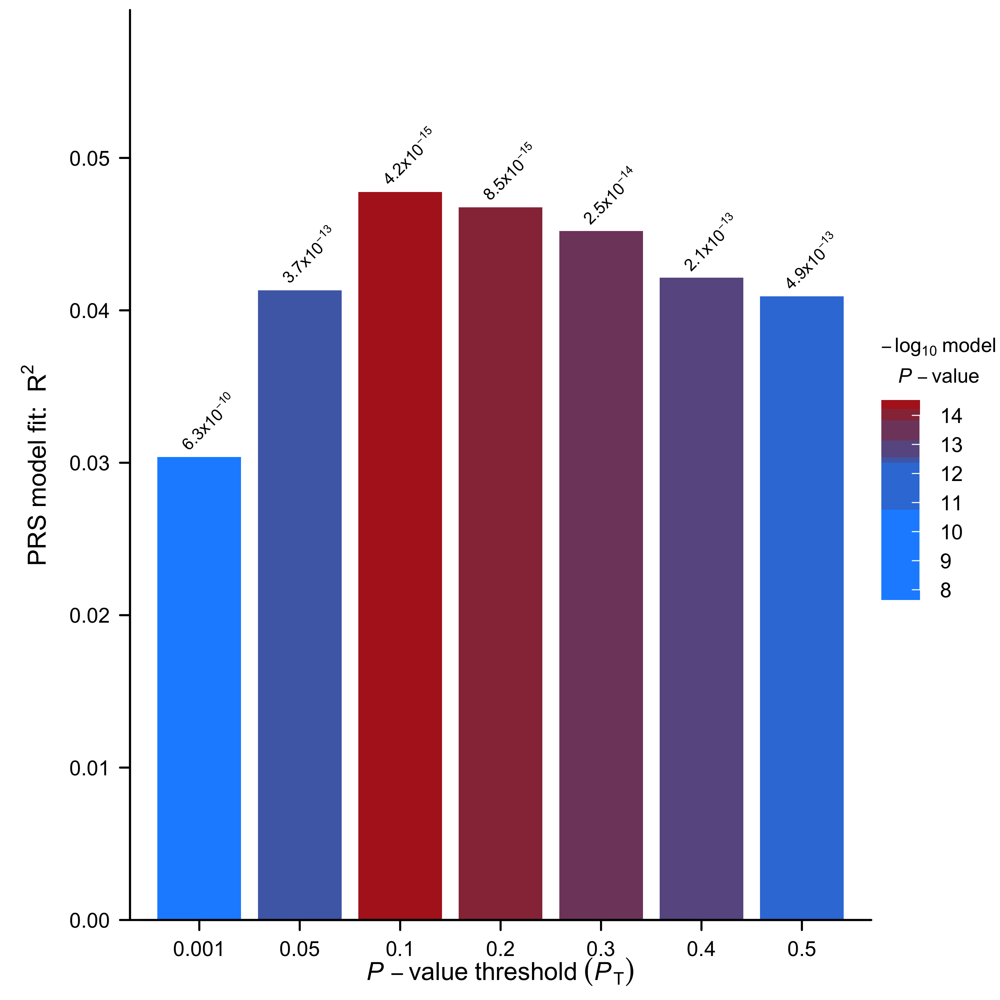

# Plotting the Results
The PRS results corresponding to a range of P-value thresholds obtained by application of the C+T PRS method (eg. using PLINK or PRSice-2) can be visualised using `R` as follows:

!!! note
    We will be using `prs.result` variable, which was generated in the [previous section](#finding-the-best-p-value-threshold)

=== "Without ggplot2"

    ```R
    # We strongly recommend the use of ggplot2. Only follow this code if you
    # are desperate.
    # Specify that we want to generate plot in EUR.height.bar.png
    png("EUR.height.bar.png",
        height=10, width=10, res=300, unit="in")
    # First, obtain the colorings based on the p-value
    col <- suppressWarnings(colorRampPalette(c("dodgerblue", "firebrick")))
    # We want the color gradient to match the ranking of p-values
    prs.result <- prs.result[order(-log10(prs.result$P)),]
    prs.result$color <-  col(nrow(prs.result))
    prs.result <- prs.result[order(prs.result$Threshold),]
    # generate a pretty format for p-value output
    prs.result$print.p <- round(prs.result$P, digits = 3)
    prs.result$print.p[!is.na(prs.result$print.p) & prs.result$print.p == 0 ] <-
        format(prs.result$P[!is.na(prs.result$print.p) & prs.result$print.p == 0 ], digits = 2)
    prs.result$print.p <- sub("e", "*x*10^", prs.result$print.p)
    # Generate the axis labels
    xlab <- expression(italic(P) - value ~ threshold ~ (italic(P)[T]))
    ylab <- expression(paste("PRS model fit:  ", R ^ 2))
    # Setup the drawing area
    layout(t(1:2), widths=c(8.8,1.2))
    par( cex.lab=1.5, cex.axis=1.25, font.lab=2, 
        oma=c(0,0.5,0,0),
        mar=c(4,6,0.5,0.5))
    # Plotting the bars
    b<- barplot(height=prs.result$R2, 
                col=prs.result$color, 
                border=NA, 
                ylim=c(0, max(prs.result$R2)*1.25), 
                axes = F, ann=F)
    # Plot the axis labels and axis ticks
    odd <- seq(0,nrow(prs.result)+1,2)
    even <- seq(1,nrow(prs.result),2)
    axis(side=1, at=b[odd], labels=prs.result$Threshold[odd], lwd=2)
    axis(side=1, at=b[even], labels=prs.result$Threshold[even],lwd=2)
    axis(side=1, at=c(0,b[1],2*b[length(b)]-b[length(b)-1]), labels=c("","",""), lwd=2, lwd.tick=0)
    # Write the p-value on top of each bar
    text( parse(text=paste(
        prs.result$print.p)), 
        x = b+0.1, 
        y =  prs.result$R2+ (max(prs.result$R2)*1.05-max(prs.result$R2)), 
        srt = 45)
    # Now plot the axis lines
    box(bty='L', lwd=2)
    axis(2,las=2, lwd=2)
    # Plot the axis titles
    title(ylab=ylab, line=4, cex.lab=1.5, font=2 )
    title(xlab=xlab, line=2.5, cex.lab=1.5, font=2 )
    # Generate plot area for the legend
    par(cex.lab=1.5, cex.axis=1.25, font.lab=2, 
        mar=c(20,0,20,4))
    prs.result <- prs.result[order(-log10(prs.result$P)),]
    image(1, -log10(prs.result$P), t(seq_along(-log10(prs.result$P))), col=prs.result$color, axes=F,ann=F)
    axis(4,las=2,xaxs='r',yaxs='r', tck=0.2, col="white")
    # plot legend title
    title(bquote(atop(-log[10] ~ model, italic(P) - value), ), 
            line=2, cex=1.5, font=2, adj=0)
    # write the plot to file
    dev.off()
    q() # exit R
    ```

=== "ggplot2"

    ```R 
    # ggplot2 is a handy package for plotting
    library(ggplot2)
    # generate a pretty format for p-value output
    prs.result$print.p <- round(prs.result$P, digits = 3)
    prs.result$print.p[!is.na(prs.result$print.p) &
                        prs.result$print.p == 0] <-
        format(prs.result$P[!is.na(prs.result$print.p) &
                                prs.result$print.p == 0], digits = 2)
    prs.result$print.p <- sub("e", "*x*10^", prs.result$print.p)
    # Initialize ggplot, requiring the threshold as the x-axis (use factor so that it is uniformly distributed)
    ggplot(data = prs.result, aes(x = factor(Threshold), y = R2)) +
        # Specify that we want to print p-value on top of the bars
        geom_text(
            aes(label = paste(print.p)),
            vjust = -1.5,
            hjust = 0,
            angle = 45,
            cex = 4,
            parse = T
        )  +
        # Specify the range of the plot, *1.25 to provide enough space for the p-values
        scale_y_continuous(limits = c(0, max(prs.result$R2) * 1.25)) +
        # Specify the axis labels
        xlab(expression(italic(P) - value ~ threshold ~ (italic(P)[T]))) +
        ylab(expression(paste("PRS model fit:  ", R ^ 2))) +
        # Draw a bar plot
        geom_bar(aes(fill = -log10(P)), stat = "identity") +
        # Specify the colors
        scale_fill_gradient2(
            low = "dodgerblue",
            high = "firebrick",
            mid = "dodgerblue",
            midpoint = 1e-4,
            name = bquote(atop(-log[10] ~ model, italic(P) - value),)
        ) +
        # Some beautification of the plot
        theme_classic() + theme(
            axis.title = element_text(face = "bold", size = 18),
            axis.text = element_text(size = 14),
            legend.title = element_text(face = "bold", size =
                                            18),
            legend.text = element_text(size = 14),
            axis.text.x = element_text(angle = 45, hjust =
                                        1)
        )
    # save the plot
    ggsave("EUR.height.bar.png", height = 7, width = 7)
    q() # exit R
    ```


> An example bar plot generated using `ggplot2`

In addition, we can visualise the relationship between the "best-fit" PRS (which may have been obtained from any of the PRS programs) and the phenotype of interest, coloured according to sex:

=== "Without ggplot2"

    ```R
    # Read in the files
    prs <- read.table("EUR.0.3.profile", header=T)
    height <- read.table("EUR.height", header=T)
    sex <- read.table("EUR.cov", header=T)
    # Rename the sex
    sex$Sex <- as.factor(sex$Sex)
    levels(sex$Sex) <- c("Male", "Female")
    # Merge the files
    dat <- merge(merge(prs, height), sex)
    # Start plotting
    plot(x=dat$SCORE, y=dat$Height, col="white",
        xlab="Polygenic Score", ylab="Height")
    with(subset(dat, Sex=="Male"), points(x=SCORE, y=Height, col="red"))
    with(subset(dat, Sex=="Female"), points(x=SCORE, y=Height, col="blue"))
    q() # exit R
    ```

=== "ggplot2"

    ```R
    library(ggplot2)
    # Read in the files
    prs <- read.table("EUR.0.3.profile", header=T)
    height <- read.table("EUR.height", header=T)
    sex <- read.table("EUR.cov", header=T)
    # Rename the sex
    sex$Sex <- as.factor(sex$Sex)
    levels(sex$Sex) <- c("Male", "Female")
    # Merge the files
    dat <- merge(merge(prs, height), sex)
    # Start plotting
    ggplot(dat, aes(x=SCORE, y=Height, color=Sex))+
        geom_point()+
        theme_classic()+
        labs(x="Polygenic Score", y="Height")
    q() # exit R
    ```


> An example scatter plot generated using `ggplot2`


Programs such as PRSice-2 and [bigsnpr](https://privefl.github.io/bigsnpr/) include numerous options for plotting PRS results.

